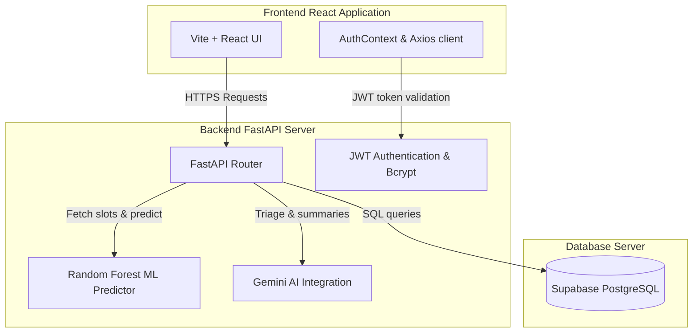

# CareSync AI — Intelligence-Driven Clinical Operations & Appointment Management Platform

## 1. Introduction & Overview
CareSync AI is an enterprise-grade healthcare management and clinical intelligence platform designed to streamline appointment scheduling, patient triaging, and operational analytics. Built on a modern three-tier web architecture, the platform enables seamless coordination between Patients, Doctors, and Administrators. 

At its core, CareSync AI addresses key operational bottlenecks in healthcare services:
1. **Patient Triage & Consultation Summarization:** Leverages Google Gemini AI to analyze patient-reported symptoms, map them to clinical specialties, and generate clear, patient-friendly consultation summaries from doctors' technical notes.
2. **Predictive Analytics for No-Show Mitigation:** Employs an ensemble Machine Learning model (Random Forest Classifier) that evaluates historical appointment variables to predict the probability of patient no-shows in real time, advising coordinators during the booking flow.
3. **Role-Based Access Control (RBAC):** Restricts interface views and data accessibility through strict, roles-based policies (Patient, Doctor, Admin) backed by JSON Web Token (JWT) authorization.

---

## 2. Platform Features & Capabilities

### 2.1. Patient Workspace
* **Intelligent Symptom Triage:** Patients can input current symptoms, which are parsed by the Gemini AI engine to match the patient with the correct clinical specialty (e.g., Cardiology, Pediatrics) and explain why the match was made.
* **Triage Chatbot:** A real-time conversational agent capable of answering basic health FAQs and providing general wellness guidelines.
* **Interactive Appointment Booking:** Seamless scheduling calendar displaying doctors' real-time availability slots. It integrates with the ML predictor to display booking advice based on historical cancellation risk.
* **Unified Notifications:** Live, dismissible alert feed notifying patients of appointment updates, doctor cancellations, or new medical notes.
* **Electronic Health Records (EHR):** Direct access to historical consultation records, including symptoms, official diagnoses, and customized treatment plans.

### 2.2. Doctor Workspace
* **Interactive Schedule & Daily Tasks:** A central calendar view mapping scheduled appointments and displaying doctor-specific daily task lists/notes.
* **Clinical Records Management:** Seamless interface for completing appointments, recording symptoms, documenting official diagnoses, and prescribing treatment courses.
* **Flexible Availability Configuration:** A weekly slot manager letting doctors set, override, and activate/deactivate specific days and time slots.
* **Cancellation Workflows:** Secure cancellation modals requiring reason logs, which trigger automatic patient notification alerts.

### 2.3. Administrative Workspace
* **Operational Metrics Dashboards:** Rich data visualizations using Recharts displaying:
  * Specialty demand and appointment distributions.
  * Average patient wait times and peak clinic operating hours.
  * Historical no-show statistics and cancellation rates.
* **User & Clinic Registry Management:** Central registry interface to oversee system users, register clinics, configure medical specialties, and monitor overall database state.

---

## 3. System Architecture & Flow

CareSync AI implements a decoupled **Three-Tier Architecture** consisting of a React client, a containerized FastAPI web server, and a PostgreSQL database.



### 3.1. Data Flow & Mechanics
1. **Authentication Flow:** Users authenticate via the `LoginRegister` page. The backend validates credentials against the database using **Bcrypt** hashing. Upon validation, the backend generates an asymmetric **HS256 JWT access token** returned to the client. The client stores the token in `localStorage` and injects it into subsequent HTTP request headers via an **Axios interceptor**.
2. **Scheduling & Prediction Pipeline:** When a patient selects an appointment slot, the client queries the backend API. The API feeds the appointment features (Patient Age, slot hour, day of the week, target doctor, and specialty) into the pre-trained **Random Forest model**. The model computes a probability score, which the client renders as a color-coded risk indicator.
3. **GenAI Triage & Notes Summary Flow:** Patient triage requests are sent to the `/api/ai/triage` route. The Gemini service queries the Gemini API with structured prompts to map symptoms to specialties. If the Gemini API limit is exceeded or offline, a local fallback parser evaluates keyword regex lists and routes the request gracefully. When doctors input clinical notes, the same GenAI engine processes technical summaries into simplified, patient-oriented texts.

---

## 4. Repository Structure & File Map

Here is an explanation of the files making up the CareSync AI repository:

```
CareSync AI/
├── Dockerfile                         # Configures the Python 3.10 runtime environment and entry point for backend deployment.
├── README.md                          # Platform documentation, architecture maps, and user guides.
│
├── database/
│   └── schema.sql                    # SQL DDL script defining the relational tables, foreign keys, and indexes.
│
├── backend/
│   ├── requirements.txt              # Backend dependencies (fastapi, scikit-learn, sqlalchemy, psycopg2-binary, etc.)
│   └── app/
│       ├── main.py                   # FastAPI application initiator. Configures CORS, mounts routers, and executes ML training on start-up.
│       ├── database.py               # Setup file for SQLAlchemy ORM engines, local sessions, and db-dependency helpers.
│       ├── config.py                 # Pydantic Settings class mapping system environment secrets.
│       │
│       ├── models/
│       │   └── models.py             # Relational Database Models (User, Patient, Doctor, Specialty, Clinic, Appointment, etc.).
│       │
│       ├── schemas/
│       │   └── schemas.py            # Pydantic models for request/response serialization and validation (e.g. phone regex).
│       │
│       ├── routes/
│       │   ├── auth_routes.py        # Endpoints for user authentication, registration, token verification, and profile recovery.
│       │   ├── patient_routes.py     # Endpoints handling patient dashboards, slot bookings, and notifications.
│       │   ├── doctor_routes.py      # Endpoints managing doctor availability, daily schedules, and consultation completions.
│       │   ├── admin_routes.py       # Endpoints computing admin charts statistics, clinic registries, and user records.
│       │   └── ai_routes.py          # Endpoints handling GenAI symptom triage, clinical summary parsing, and chatbot threads.
│       │
│       ├── services/
│       │   ├── auth.py               # Core cryptography services managing Bcrypt password verification and JWT token creation.
│       │   ├── analytics.py          # Service executing SQL queries for wait times, peak hours, and appointment statuses.
│       │   └── gemini_service.py     # Wraps the Google GenAI interface and manages keyword-matching local fallbacks.
│       │
│       ├── ml/
│       │   └── no_show_model.py      # Code to train, evaluate, and preprocess data for the Random Forest no-show predictor.
│       │
│       ├── seed.py                   # Relational seed file populating the database with clinics, specialties, and 550+ mock appointments.
│       ├── test_main.py              # Pytest integration tests covering authentication routing and appointment operations.
│       └── test_profile.py           # Pytest unit tests validating profile schemas and validation regexes.
│
└── frontend/
    ├── package.json                  # Frontend dependencies (React, Recharts, TailwindCSS, Vite, Axios, etc.)
    ├── index.html                    # HTML wrapper defining viewports, typography, and fonts.
    ├── tailwind.config.js            # TailwindCSS utility classes configurations.
    ├── postcss.config.js             # PostCSS rules for compile optimizations.
    ├── vercel.json                   # Single-Page Application (SPA) routing rules for Vercel deployment.
    ├── vite.config.js                # Vite compiler settings.
    │
    └── src/
        ├── main.jsx                  # Main entry point mounting the App on the DOM.
        ├── App.jsx                   # Central router configuring page paths and role-based route protection guards.
        ├── index.css                 # Base styles configuring color tokens, custom animations, and layout scrollbars.
        │
        ├── context/
        │   └── AuthContext.jsx       # Global Auth Hook caching user state and orchestrating login/logout mechanics.
        │
        ├── services/
        │   └── api.js                # Axios instance appending JWT tokens automatically to outbound headers.
        │
        └── pages/
            ├── LoginRegister.jsx     # Combined login/register page with responsive role selectors.
            ├── PatientDashboard.jsx  # Patients home dashboard, AI chatbot client, booking forms, and notifications panel.
            ├── DoctorDashboard.jsx   # Doctors scheduling panel, notes diary, appointment detail views, and availability controls.
            └── AdminDashboard.jsx    # Admins management console containing Recharts operational metrics.
```

---

## 5. Development & Setup Guide

### 5.1. Local Installation

#### Prerequisites
- **Node.js** (v18+)
- **Python** (v3.10+)
- **PostgreSQL** running locally on port `5432` with a database named `caresync`.

#### Step 1: Relational Schema Instantiation
1. Ensure your local PostgreSQL cluster is running.
2. Initialize the target database:
   ```bash
   createdb caresync
   ```

#### Step 2: Backend Microservice Configuration
1. Navigate to the project root directory and build a python virtual environment:
   ```bash
   python3 -m venv .venv
   source .venv/bin/activate
   ```
2. Install the library dependencies:
   ```bash
   pip install -r backend/requirements.txt
   ```
3. Set your system environment secrets inside a `.env` file under `backend/`:
   ```env
   DATABASE_URL=postgresql://localhost/caresync
   GEMINI_API_KEY=YOUR_GEMINI_KEY_HERE
   ```
4. Execute the Python database seed script to populate clinical tables and generate mock appointments:
   ```bash
   PYTHONPATH=backend .venv/bin/python backend/app/seed.py
   ```
5. Trigger initial machine learning model training to serialize the local classifier pipeline:
   ```bash
   PYTHONPATH=backend .venv/bin/python backend/app/ml/no_show_model.py
   ```
6. Launch the development server using Uvicorn:
   ```bash
   PYTHONPATH=backend .venv/bin/uvicorn app.main:app --host 127.0.0.1 --port 8000 --reload
   ```
   *The interactive Swagger UI API documentation will mount at `http://127.0.0.1:8000/docs`.*

#### Step 3: Frontend Client Configuration
1. Navigate to the client folder:
   ```bash
   cd frontend
   ```
2. Install npm node modules:
   ```bash
   npm install
   ```
3. Boot the Vite React development server:
   ```bash
   npm run dev
   ```
   *The client interface will launch at `http://localhost:5173`.*

---

## 6. Seed Credentials for Testing & Demonstration

Use these preloaded database credentials to test role-specific functionalities:

| Role | Username / Email | Password | Panel Functionality |
| :--- | :--- | :--- | :--- |
| **Admin** | `admin@caresync.com` | `admin123` | Operational metrics charts & user registries |
| **Doctor** | `doctor1@caresync.com` | `doctor123` | Workspace, calendar notes, bulk scheduler, cancel modal |
| **Patient** | `patient1@caresync.com` | `patient123` | Booking grid, notifications, medical records, AI chatbot |

*Note: You can log in as any patient up to `patient50@caresync.com` and doctor up to `doctor10@caresync.com` using the same passwords.*

---

## 7. Verification and Automated Testing

Run automated checks using the built-in testing suites:

### 7.1. Backend Test Execution
With the virtual environment active in the project root, run:
```bash
PYTHONPATH=backend .venv/bin/pytest
```
*Tests validate JWT encoding, scheduling collision preventions, telephone number regex validations, and dashboard state changes.*

### 7.2. Frontend Build Verification
Confirm the client compiles with zero warnings or structural defects:
```bash
cd frontend
npm run build
```
