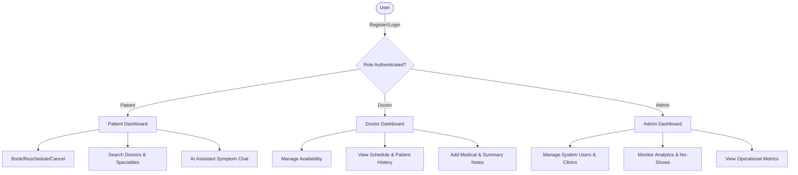

# Product Requirement Document (PRD)

## CareSync AI — Healthcare Appointment & Intelligence Platform

### 1. Overview
CareSync AI is an enterprise-grade, intelligence-driven healthcare appointment platform. It serves three distinct user roles (Patients, Doctors, and Admins) to streamline clinical operations, optimize appointments, and provide automated AI-driven patient support and clinical insights.

---

### 2. User Roles & Workflows



#### 2.1 Patient
*   **Onboarding:** Register and authenticate via email/password.
*   **Doctor Discovery:** Search and filter doctors by name, specialty, location, and real-time availability.
*   **Booking Flow:** Seamless booking, rescheduling, and cancellation of appointments.
*   **Engagement:** Chat with an interactive AI Symptom Assistant to get recommendation matches for medical specialties.
*   **History:** View detailed history of past and upcoming consultations.

#### 2.2 Doctor
*   **Schedule Management:** Define custom time slots, block off times, and manage dynamic availability.
*   **Consultation Hub:** View calendar of daily appointments, patient record history, and change status of appointments (e.g., Scheduled, Completed, No-Show).
*   **Clinical Records:** Add clinical notes post-appointment and request AI summaries of patient concerns.

#### 2.3 Admin
*   **Operations Control:** Manage registrations, clinics, user profiles, and doctor profiles.
*   **Business Intelligence Dashboard:** Monitor system-wide appointment statistics, cancel rates, doctor utilization, and no-show alerts.
*   **AI Predictors:** View automated insights on wait times, peak hours, and appointment no-show probabilities.

---

### 3. Feature Phasing

#### Phase 1: Functional MVP (Core Application)
*   **Role-Based Authentication:** JWT-based secure auth for Patients, Doctors, and Admins.
*   **Database Schema:** PostgreSQL persistence with SQLAlchemy ORM (configured for easy local running via Docker or local PostgreSQL server).
*   **Patient Dashboard & Booking Engine:** Search doctors, view open slots, and schedule/reschedule/cancel.
*   **Doctor Dashboard:** View agenda, update appointment statuses, write clinical notes.
*   **Admin Dashboard:** Basic CRUD management for doctors/patients/clinics, plus aggregate statistics.

#### Phase 2: Intelligence Layer (Analytics & ML)
*   **No-Show Prediction Engine:** Logistic Regression or Random Forest model (scikit-learn) predicting the likelihood of a patient missing their appointment based on demographic features, past history, and time of day.
*   **Doctor Utilization Insights:** Charts mapping out total booked hours vs. available hours.
*   **Wait-Time Predictor:** Custom heuristics and ML estimating expected in-clinic waiting time based on historical clinic volumes and specialty.
*   **Peak-Hour & Specialty Demand Analysis:** Advanced Recharts dashboards visualizing trends.

#### Phase 3: GenAI Features (Gemini API Integration)
*   **AI Symptom-based Specialty Recommendation:** Conversational AI matching patient-described symptoms to the most relevant doctor specialty.
*   **Consultation Summarizer:** One-click summary of doctor clinical notes for patients.
*   **Patient FAQ Assistant:** Natural language responder for clinic questions.

---

### 4. Technical Architecture & Stack

```
┌──────────────────────────────────────────────────────────────────┐
│                           FRONTEND                               │
│  React (Vite) + Tailwind CSS + React Router + Axios + Recharts   │
└────────────────────────────────┬─────────────────────────────────┘
                                 │ HTTP / JSON
                                 ▼
┌──────────────────────────────────────────────────────────────────┐
│                           BACKEND                                │
│       FastAPI + SQLAlchemy + JWT Auth + Uvicorn + Pydantic       │
└──────┬─────────────────────────┬─────────────────────────┬───────┘
       │ SQL                     │ API Calls               │ Data / Train
       ▼                         ▼                         ▼
┌──────────────┐          ┌──────────────┐          ┌──────────────┐
│   DATABASE   │          │  GEMINI AI   │          │ MACHINE LRN  │
│  PostgreSQL  │          │    models/   │          │ Scikit-learn │
│  (Docker/    │          │  gemini-2.5  │          │   + Pandas   │
│   Local)     │          │  or similar  │          │              │
└──────────────┘          └──────────────┘          └──────────────┘
```

*   **Frontend:**
    *   **Vite + React (JS):** High-speed frontend framework.
    *   **Tailwind CSS:** Modern, custom utility styling.
    *   **Recharts:** Visual analytics for Admin and Doctor dashboards.
*   **Backend:**
    *   **FastAPI:** High-performance, async-capable Python web framework.
    *   **SQLAlchemy:** ORM abstraction configured for PostgreSQL.
    *   **psycopg2-binary:** PostgreSQL database driver.
    *   **Alembic:** Database migrations.
    *   **JWT Security:** `passlib` (bcrypt) for hashing and `pyjwt` for secure token exchange.
*   **AI / Analytics:**
    *   **Gemini API (google-genai):** AI-driven symptom recommendations and summarizations.
    *   **Scikit-Learn & Pandas:** Python machine learning stack for training and serving the No-Show Prediction and Wait-Time engines.

---

### 5. Detailed Database Schema

We define the schema with relational integrity and proper foreign keys:

1.  **`users`**: Core authentication and credential details.
    *   `id` (UUID/Integer, PK)
    *   `email` (VARCHAR, Unique, Indexed)
    *   `hashed_password` (VARCHAR)
    *   `role` (Enum: 'patient', 'doctor', 'admin')
    *   `created_at` (TIMESTAMP)
2.  **`patients`**: Patient demographic profiles.
    *   `id` (UUID/Integer, PK, FK -> `users.id`)
    *   `first_name` (VARCHAR)
    *   `last_name` (VARCHAR)
    *   `phone` (VARCHAR)
    *   `date_of_birth` (DATE)
    *   `gender` (VARCHAR)
3.  **`specialties`**: List of clinical disciplines.
    *   `id` (Integer, PK)
    *   `name` (VARCHAR, Unique)
    *   `description` (TEXT)
4.  **`clinics`**: Location and contact details.
    *   `id` (Integer, PK)
    *   `name` (VARCHAR)
    *   `address` (VARCHAR)
    *   `phone` (VARCHAR)
5.  **`doctors`**: Doctor professional details.
    *   `id` (UUID/Integer, PK, FK -> `users.id`)
    *   `specialty_id` (Integer, FK -> `specialties.id`)
    *   `clinic_id` (Integer, FK -> `clinics.id`)
    *   `bio` (TEXT)
    *   `consultation_fee` (DECIMAL)
6.  **`doctor_availability`**: Scheduled time slots for doctors.
    *   `id` (Integer, PK)
    *   `doctor_id` (Integer, FK -> `doctors.id`)
    *   `day_of_week` (Integer: 0-6)
    *   `start_time` (TIME)
    *   `end_time` (TIME)
    *   `is_active` (BOOLEAN)
7.  **`appointments`**: Patient-Doctor bookings.
    *   `id` (Integer, PK)
    *   `patient_id` (Integer, FK -> `patients.id`)
    *   `doctor_id` (Integer, FK -> `doctors.id`)
    *   `appointment_date` (DATE)
    *   `start_time` (TIME)
    *   `status` (Enum: 'scheduled', 'completed', 'cancelled', 'no_show')
    *   `created_at` (TIMESTAMP)
8.  **`medical_notes`**: Clinical summaries created after visits.
    *   `id` (Integer, PK)
    *   `appointment_id` (Integer, FK -> `appointments.id`, Unique)
    *   `symptoms` (TEXT)
    *   `diagnosis` (TEXT)
    *   `treatment_plan` (TEXT)
    *   `created_at` (TIMESTAMP)
9.  **`appointment_feedback`**: Ratings and written reviews.
    *   `id` (Integer, PK)
    *   `appointment_id` (Integer, FK -> `appointments.id`, Unique)
    *   `rating` (Integer, 1-5)
    *   `comments` (TEXT)
10. **`notifications`**: System alerts for users.
    *   `id` (Integer, PK)
    *   `user_id` (Integer, FK -> `users.id`)
    *   `title` (VARCHAR)
    *   `message` (TEXT)
    *   `is_read` (BOOLEAN)
    *   `created_at` (TIMESTAMP)
